# Analysis And Design: Ecommerce AI

## 1. Mục tiêu tài liệu

Tài liệu này mô tả kiến trúc, luồng xử lý, thiết kế dữ liệu và định hướng mở rộng cho project `ecommerce_ai`, một hệ thống ecommerce theo hướng microservices có tích hợp AI cho:

- gợi ý sản phẩm theo hành vi người dùng
- chatbot tư vấn dựa trên knowledge retrieval
- quản trị đa vai trò `customer`, `staff`, `admin`

Tài liệu được chia theo 2 lớp:

- `As-Is`: phản ánh đúng hiện trạng code đang có
- `To-Be`: đề xuất thiết kế mục tiêu để hệ thống hoàn chỉnh hơn ở quy mô production/demo nâng cao

---

## 2. Tổng quan bài toán

### 2.1 Bài toán nghiệp vụ

Hệ thống cần hỗ trợ:

- người dùng đăng nhập theo vai trò
- duyệt catalog sản phẩm
- thêm sản phẩm vào giỏ hàng
- thanh toán và theo dõi đơn hàng
- nhận gợi ý sản phẩm bằng AI
- chat hỏi đáp về sản phẩm, bundle, category

### 2.2 Mục tiêu AI

Project đang theo đuổi 2 năng lực AI tách biệt:

1. `Behavior Recommendation`
   Dự đoán hành động kế tiếp của người dùng từ chuỗi hành vi gần đây và map sang nhóm sản phẩm đề xuất.

2. `RAG-like Product Advisory`
   Truy xuất tri thức liên quan tới sản phẩm/category/bundle rồi sinh câu trả lời tư vấn.

---

## 3. Kiến trúc tổng thể

### 3.1 Danh sách thành phần

| Thành phần | Vai trò chính | Port public |
|---|---|---:|
| `frontend` | React UI cho customer/staff/admin | `3001` |
| `api_gateway` | Reverse proxy + legacy portal Django | `8000` |
| `user_service` | Quản lý user theo role | `8101` |
| `product_service` | Catalog sản phẩm | `8102` |
| `order_service` | Quản lý order | `8103` |
| `behavior_service` | AI recommendation theo hành vi | `8104` |
| `rag_chat_service` | AI chat + retrieval | `8105` |
| `cart_service` | Cart domain | `8106` |
| `payment_service` | Payment domain | `8107` |
| `shipping_service` | Shipment domain | `8108` |
| `postgres_db` | DB cho product/order | `15433` |
| `mysql_db` | DB cho user | `13307` |
| `neo4j_db` | Graph knowledge backend | `17474`, `17687` |
| `vector_db` | Qdrant fallback retrieval | `16334` |
| `pgadmin` | Công cụ quản trị PostgreSQL | `15050` |

### 3.2 Sơ đồ kiến trúc mức container

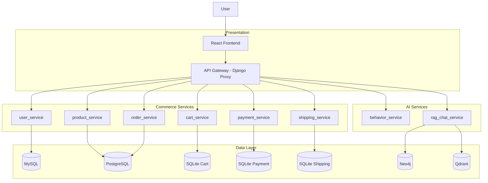

### 3.3 Nhận xét kiến trúc

Ưu điểm:

- phân tách domain tương đối rõ
- frontend và backend độc lập
- AI được tách thành service riêng
- có fallback retrieval cho chat service

Giới hạn hiện tại:

- gateway chỉ là proxy đồng bộ, chưa có auth gateway, rate limit, retry policy
- checkout chưa orchestration đầy đủ giữa `order`, `payment`, `shipping`, `cart`
- frontend đang dùng local state cho cart thay vì `cart_service`
- AI recommendation động chưa được gắn chặt vào home/catalog chính

---

## 4. Phân rã bounded context

### 4.1 Bản đồ domain

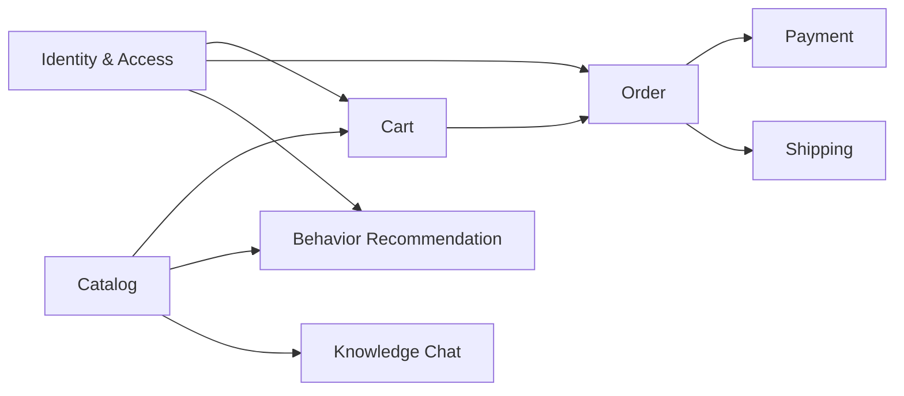

### 4.2 Vai trò của từng service

#### `user_service`

- quản lý 3 model riêng: `AdminUser`, `StaffUser`, `Customer`
- hỗ trợ CRUD qua DRF router
- có endpoint `summary/` để đếm số lượng theo role
- có endpoint `login/` để xác thực đơn giản bằng `email + password + role`

#### `product_service`

- quản lý catalog sản phẩm
- dữ liệu seed gồm 10 sản phẩm công nghệ
- thuộc tính AI hiện tại gồm `ai_match`, `image_icon`

#### `order_service`

- quản lý order tổng hợp
- lưu `status`, `payment_status`, `shipping_status`
- chưa liên kết cứng với payment/shipment bằng foreign key xuyên service

#### `cart_service`

- bounded context cho cart
- hiện có model cart tổng hợp theo customer
- chưa được frontend customer flow sử dụng trực tiếp

#### `payment_service`

- lưu giao dịch thanh toán
- trạng thái `pending/paid/...`
- hiện checkout tạo bản ghi payment trực tiếp từ frontend

#### `shipping_service`

- lưu shipment/tracking
- hiện chưa được tạo tự động trong flow checkout customer hiện tại

#### `behavior_service`

- nhận chuỗi `recent_actions`
- encode thành tensor shape `(1, 10, 1)`
- chạy model LSTM
- suy ra `predicted_next_action`
- map sang `intent` và nhóm category
- trả về danh sách `recommendations`

#### `rag_chat_service`

- seed knowledge graph từ catalog và bundle
- ưu tiên retrieve từ Neo4j
- fallback sang Qdrant
- fallback cuối là in-memory cosine retrieval
- generate câu trả lời dựa trên intent và retrieved docs

---

## 5. Thiết kế luồng request

### 5.1 Luồng request tổng quát qua gateway

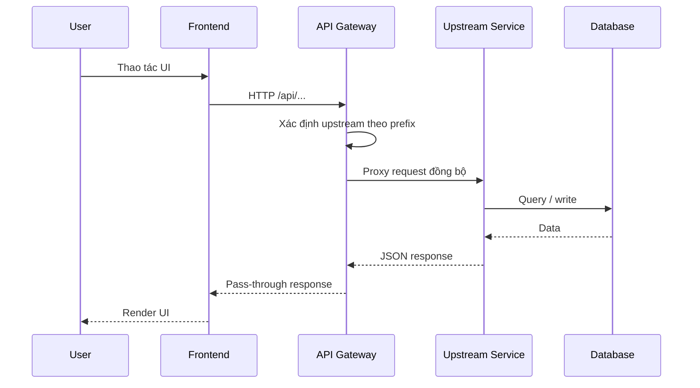

### 5.2 Mapping route tại gateway

| Route gateway | Upstream |
|---|---|
| `/api/products/...` | `product_service` |
| `/api/behavior/recommend/` | `behavior_service` |
| `/api/chat/...` | `rag_chat_service` |
| `/api/users/...` | `user_service` |
| `/api/orders/...` | `order_service` |
| `/api/carts/...` | `cart_service` |
| `/api/payments/...` | `payment_service` |
| `/api/shipments/...` | `shipping_service` |

---

## 6. Phân tích luồng nghiệp vụ hiện tại

## 6.1 Luồng đăng nhập

### As-Is

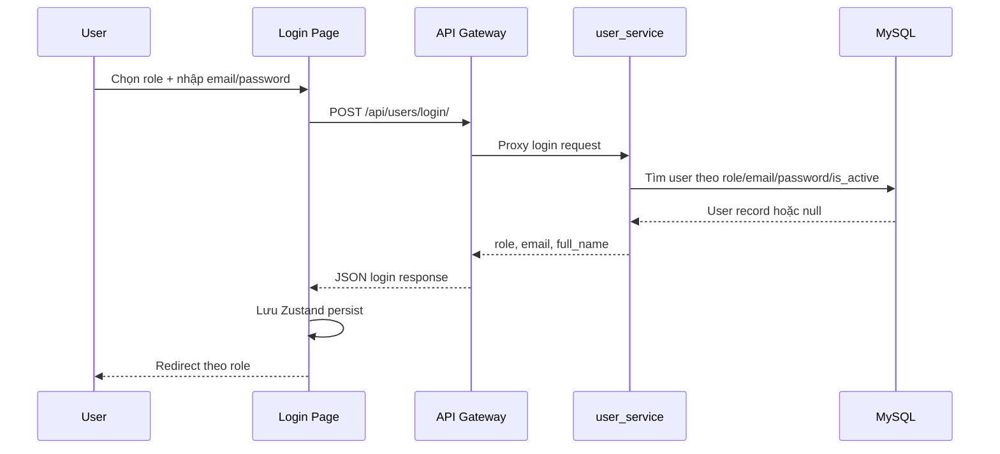

### Nhận xét

- auth hiện tại là auth đơn giản, không có JWT/session/token refresh
- password đang lưu plain text trong demo service
- frontend dùng persisted local store để giữ trạng thái đăng nhập

---

## 6.2 Luồng duyệt sản phẩm và tìm kiếm

### As-Is

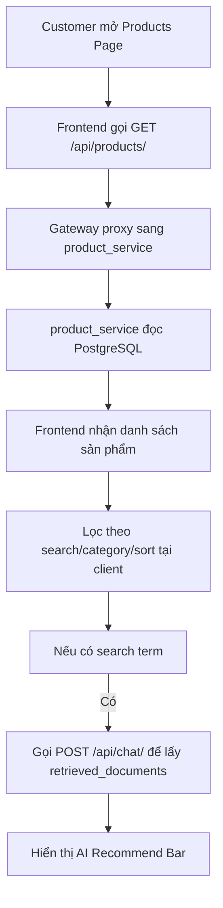

### Điểm đáng chú ý

- search text chính của catalog đang lọc ở client side
- AI recommend bar hiện không dùng `behavior_service`
- AI recommend bar dùng `rag_chat_service` để lấy `retrieved_documents`

---

## 6.3 Luồng thêm vào giỏ hàng

### As-Is

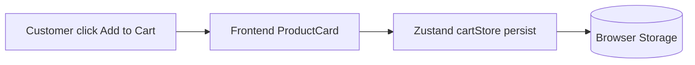

### Nhận xét

- `cart_service` tồn tại ở backend nhưng flow customer hiện tại chưa sync cart lên service này
- cart hiện thiên về state phía frontend để phục vụ demo nhanh
- đây là một khoảng trống quan trọng giữa kiến trúc microservice và implementation UI

---

## 6.4 Luồng checkout

### As-Is

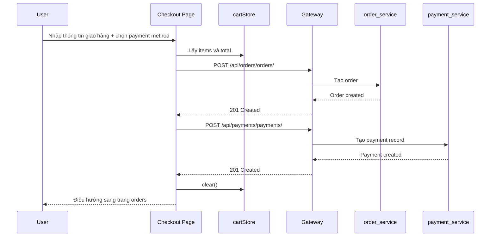

### Khoảng cách thiết kế

Hiện tại flow này:

- chưa tạo shipment
- chưa cập nhật `payment_status` của order sau khi payment tạo thành công
- chưa chuyển cart local thành cart record chính thức
- chưa có transaction/saga/rollback nếu payment fail sau khi order đã tạo

---

## 6.5 Luồng xem đơn hàng

### As-Is

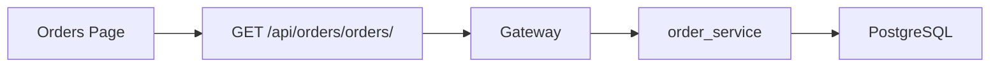

---

## 7. Phân tích luồng AI

## 7.1 Behavior recommendation pipeline

### As-Is

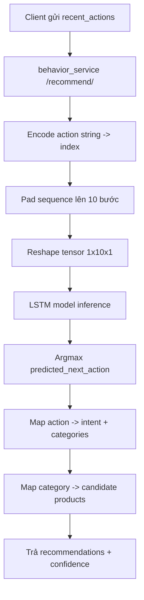

### Thiết kế logic suy luận

1. Input chính là `recent_actions`, ví dụ:

```json
["view", "click", "add_to_cart", "view", "purchase"]
```

2. Mỗi action được map sang index trong tập:

- `add_to_cart`
- `click`
- `purchase`
- `remove_from_cart`
- `review`
- `search`
- `view`
- `wishlist`

3. LSTM dự đoán action kế tiếp.

4. Action dự đoán được quy đổi sang business intent:

- `purchase` -> `high_purchase`
- `add_to_cart` -> `cart_intent`
- `wishlist` -> `wishlist`
- `view` -> `browsing`
- ...

5. Intent map sang category ưu tiên, rồi map tiếp sang danh sách product cứng.

### Điểm mạnh

- có inference thật bằng model file `model_lstm.h5`
- output có tính giải thích tương đối qua `predicted_next_action` và `reason`

### Hạn chế

- recommendation hiện dựa trên mapping tĩnh từ action sang category/product
- chưa dùng historical event thật từ user profile/order/cart
- chưa được tích hợp trực tiếp vào luồng customer chính ngoài mục tiêu demo

---

## 7.2 RAG chat pipeline

### As-Is

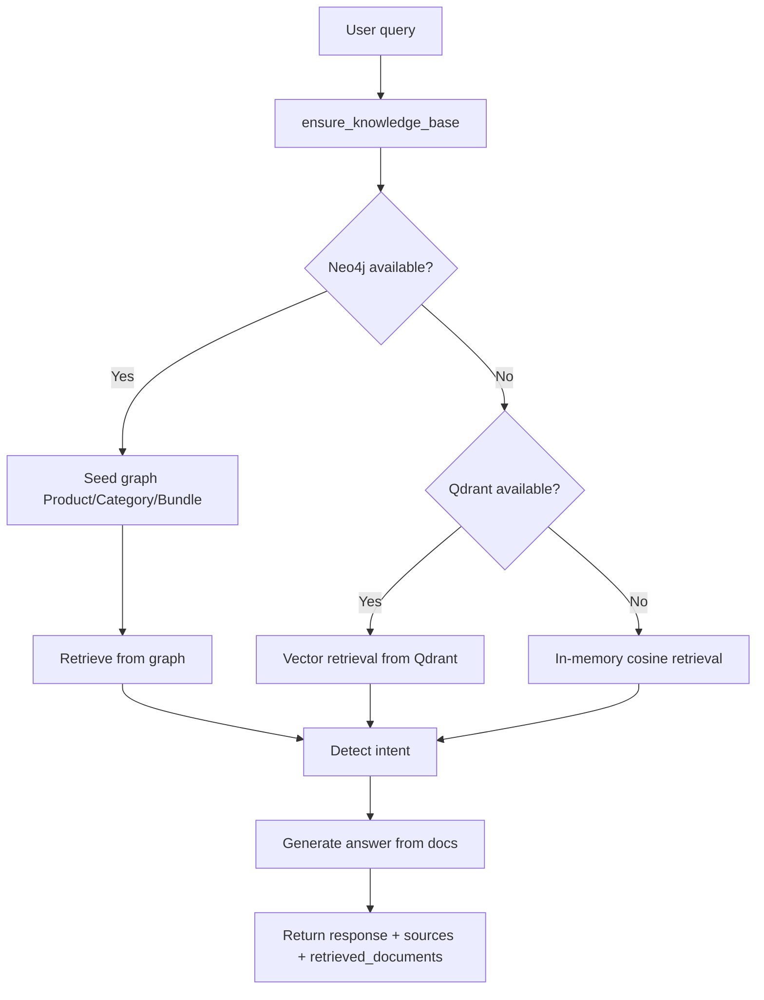

### Luồng intent detection

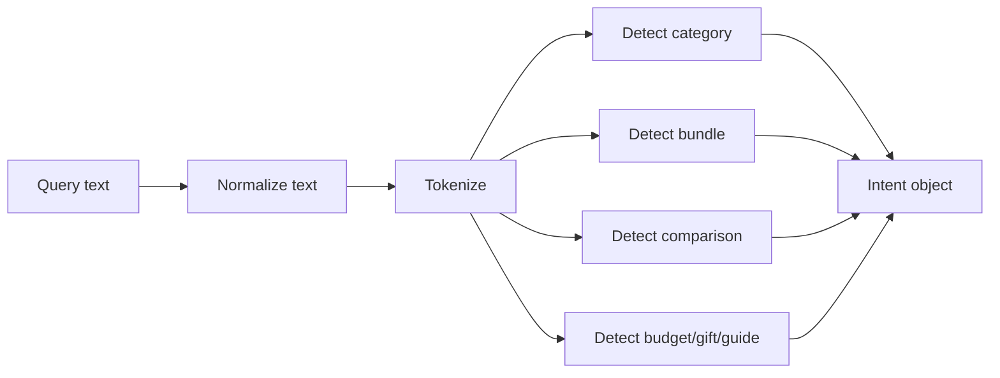

### Thiết kế knowledge graph

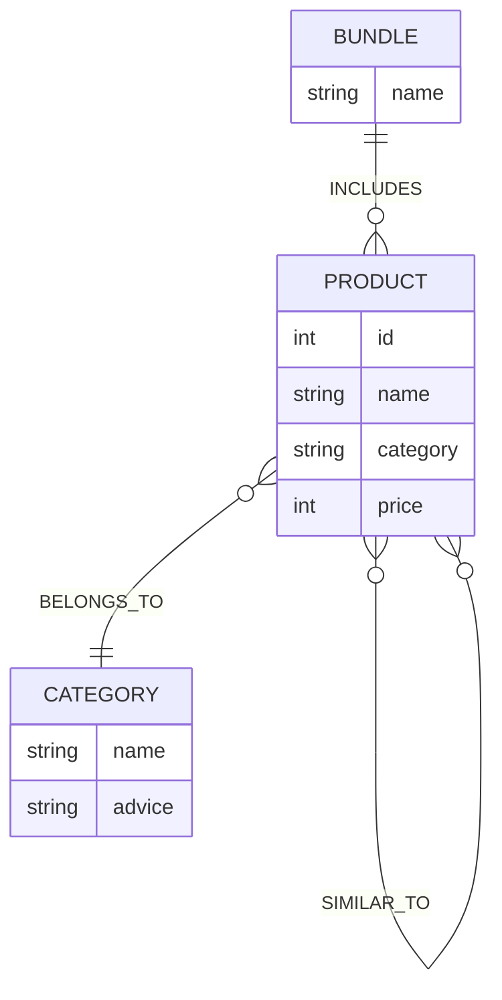

### Logic retrieve hiện tại

Thứ tự retrieve khi dùng Neo4j:

1. nếu query map được sang `bundle` thì lấy sản phẩm trong bundle đó
2. nếu query map được sang `category` thì lấy sản phẩm cùng category
3. nếu vẫn thiếu kết quả thì dùng lexical overlap theo tên sản phẩm/category

### Output chat hiện tại

Service trả về:

- `response`
- `sources`
- `retrieved_documents`
- `index_backend`

### Điểm mạnh

- có nhiều lớp fallback
- có thể trace nguồn qua `sources`
- có knowledge graph và bundle-level retrieval

### Hạn chế

- chưa gọi LLM thật để generate answer, đang dùng template answer
- embedding hiện là hashing embedding nội bộ
- knowledge base chủ yếu suy ra từ catalog nội bộ, chưa có docs/policy phong phú

---

## 8. Thiết kế dữ liệu

## 8.1 Mô hình dữ liệu các service

### `user_service`

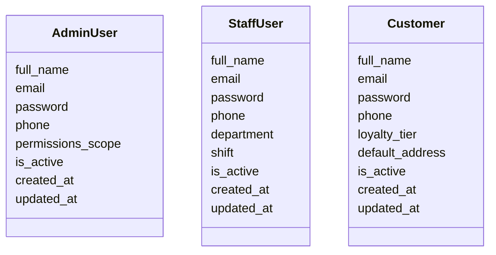

### `product_service`

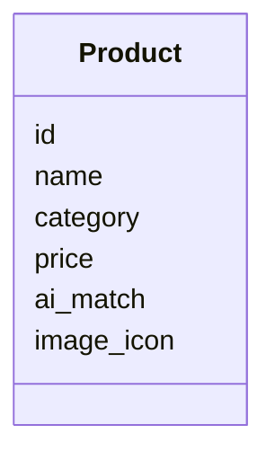

### `order_service`

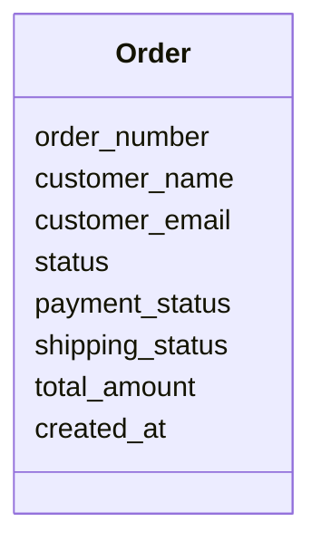

### `cart_service`

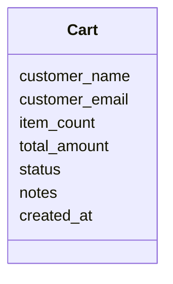

### `payment_service`

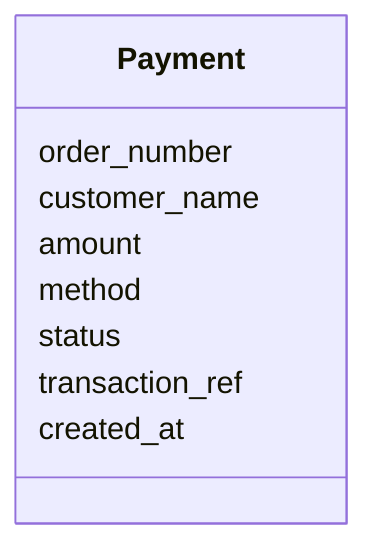

### `shipping_service`

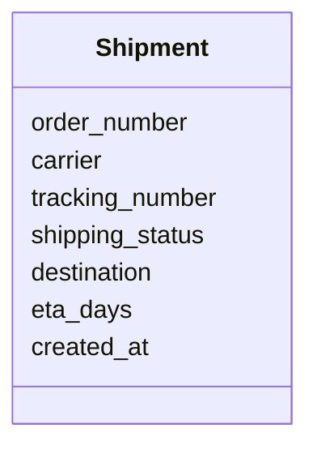

### Nhận xét thiết kế dữ liệu

- các service đang tách DB tốt theo microservice
- liên kết cross-service đang dựa trên business key như `order_number`, không phải FK vật lý
- cart chưa có line items
- order chưa có order items
- payment/shipping chưa có event history

---

## 9. As-Is và To-Be

## 9.1 So sánh ngắn gọn

| Chủ đề | As-Is | To-Be đề xuất |
|---|---|---|
| Auth | Login plain text theo role | JWT/OAuth2, RBAC thực |
| Cart | Zustand local store | Cart service làm source of truth |
| Checkout | Frontend gọi order rồi payment | Orchestrator hoặc saga |
| Shipment | Chưa tạo trong checkout | Tạo shipment sau payment success |
| Recommendation | LSTM + mapping tĩnh | Feature store + candidate retrieval + ranking |
| Chat | Rule/template generation | LLM + retrieval + citations |
| Gateway | Proxy đơn giản | Auth, rate limit, retry, tracing |
| Observability | Gần như chưa có | logs tập trung, metrics, tracing |

---

## 9.2 Thiết kế mục tiêu cho checkout

### To-Be sequence

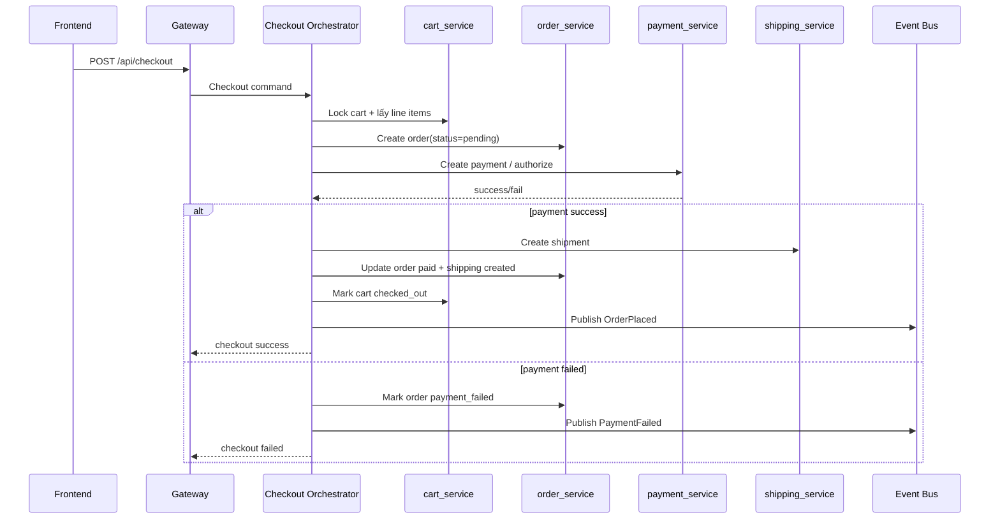

### Thành phần nên bổ sung

- `checkout_service` hoặc module orchestration riêng
- `order_item` và `cart_item`
- message broker như RabbitMQ/Kafka/Redis Streams
- idempotency key cho payment

---

## 9.3 Thiết kế mục tiêu cho AI recommendation

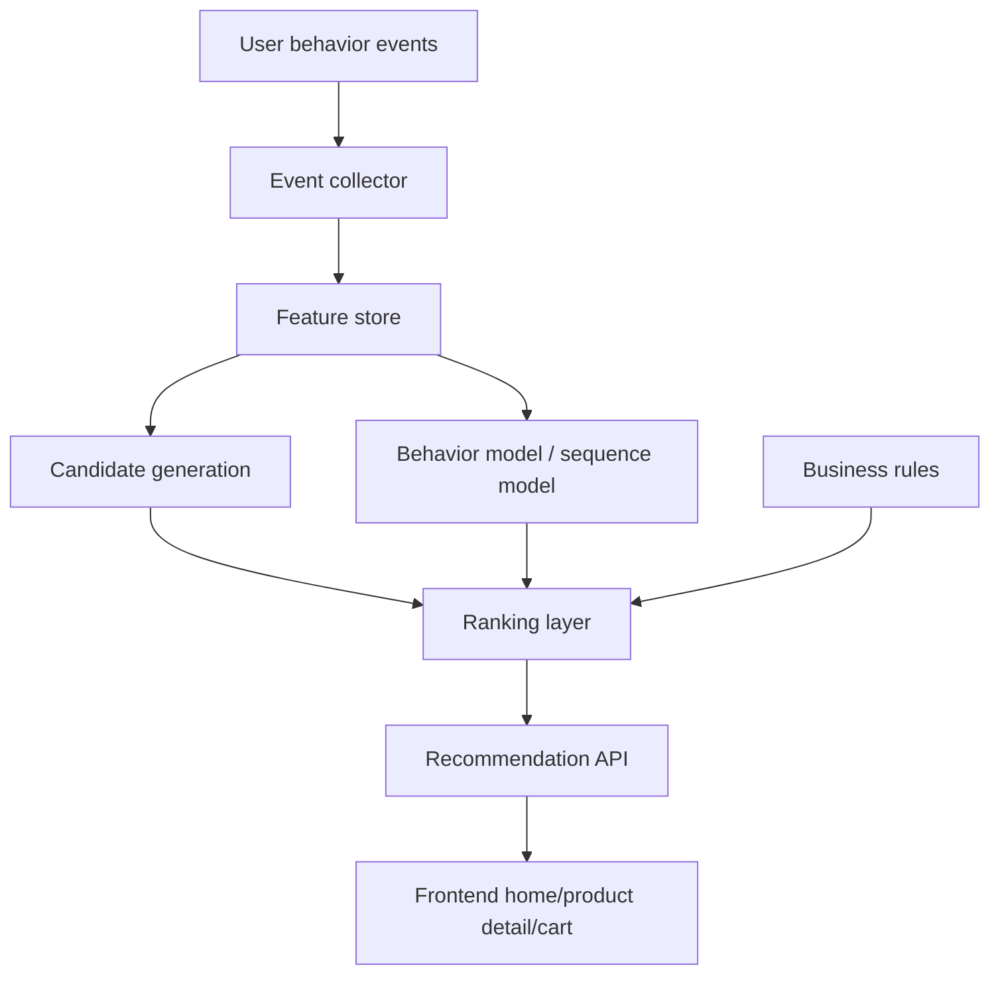

Mục tiêu:

- lấy event thật từ `view`, `search`, `cart`, `purchase`
- tách `candidate generation` khỏi `ranking`
- có online feature rõ ràng theo user/session
- dùng chung recommendation cho home, PDP, cart upsell, checkout upsell

---

## 9.4 Thiết kế mục tiêu cho AI chat

```mermaid
flowchart TD
    A[User question]
    B[Query understanding]
    C[Hybrid retrieval]
    D1[Neo4j graph retrieval]
    D2[Vector retrieval]
    D3[Policy/FAQ docs]
    E[Reranking]
    F[Prompt builder]
    G[LLM answer generation]
    H[Citations + safety layer]
    I[Chat response]

    A --> B --> C
    C --> D1
    C --> D2
    C --> D3
    D1 --> E
    D2 --> E
    D3 --> E
    E --> F --> G --> H --> I
```

Mục tiêu:

- thêm policy docs, FAQ, promotion docs, return policy
- LLM sinh câu trả lời tự nhiên hơn
- bắt buộc trả citation để người dùng thấy nguồn
- tách lớp retrieval và generation để dễ benchmark

---

## 10. Điểm mạnh hiện tại của project

- kiến trúc đã tách service đủ rõ để trình bày microservices
- có đủ domain cốt lõi của ecommerce
- có frontend React tương đối hoàn chỉnh cho demo
- có 2 service AI độc lập, phục vụ 2 use case khác nhau
- RAG service có fallback tốt, phù hợp demo môi trường lab

---

## 11. Rủi ro và technical debt

## 11.1 Rủi ro chức năng

- cart backend và cart frontend chưa thống nhất nguồn dữ liệu
- checkout có thể tạo order thành công nhưng payment lỗi, dẫn đến trạng thái lệch
- shipment chưa nằm trong checkout flow chính
- recommendation UI chính vẫn dựa nhiều vào `ai_match` seed sẵn

## 11.2 Rủi ro bảo mật

- password plain text
- chưa có token auth
- gateway pass-through đơn giản, chưa có authorization

## 11.3 Rủi ro dữ liệu

- chưa có schema event cho hành vi người dùng
- thiếu order items, cart items, payment logs
- knowledge base của chat còn khá hẹp

## 11.4 Rủi ro vận hành

- thiếu centralized logging
- thiếu distributed tracing
- thiếu health-check orchestration sâu giữa gateway và upstream

---

## 12. Đề xuất roadmap triển khai

### Giai đoạn 1: Hoàn thiện luồng ecommerce

- chuyển cart sang backend source of truth
- thêm `cart_items`, `order_items`
- tích hợp shipment vào checkout
- cập nhật order status theo payment/shipping thật

### Giai đoạn 2: Cứng hóa nền tảng

- JWT auth + RBAC
- health check cho từng service
- correlation id và log chuẩn hóa
- retry và timeout policy ở gateway

### Giai đoạn 3: Nâng cấp AI

- ingest event thật cho behavior model
- thêm feature engineering và offline evaluation
- mở rộng knowledge base
- tích hợp LLM cho answer generation có citation

### Giai đoạn 4: Production readiness

- event bus
- observability stack
- CI/CD
- test tích hợp end-to-end

---

## 13. Kết luận

`ecommerce_ai` là một đồ án/demo có cấu trúc tốt để trình bày cả 2 mặt:

- kiến trúc ecommerce microservices
- ứng dụng AI trong recommendation và product advisory

Ở hiện trạng, hệ thống đã đủ mạnh để demo kiến trúc phân tách service, login đa vai trò, catalog, order, AI recommendation và AI chat. Tuy nhiên nếu nhìn ở góc độ thiết kế hệ thống hoàn chỉnh, phần cần nâng cấp lớn nhất là:

- thống nhất source of truth cho cart/checkout
- bổ sung orchestration giữa order-payment-shipping
- nâng mức trưởng thành của auth, observability và AI pipeline

Nếu dùng tài liệu này để thuyết trình, nên nhấn mạnh rằng project đã có `As-Is implementation` khá rõ, đồng thời đã xác định được `To-Be architecture` hợp lý để tiến tới hệ thống ecommerce AI hoàn chỉnh hơn.
