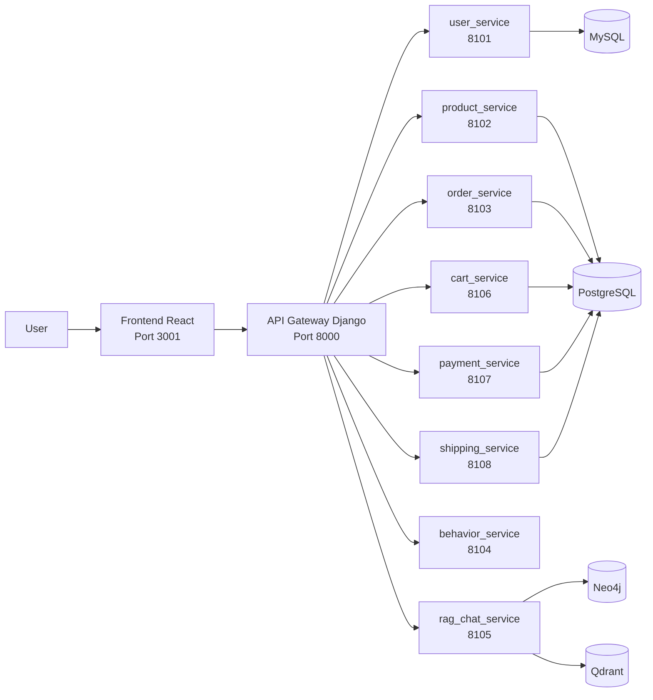
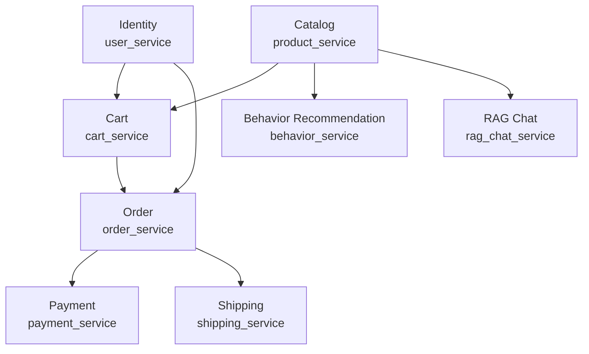
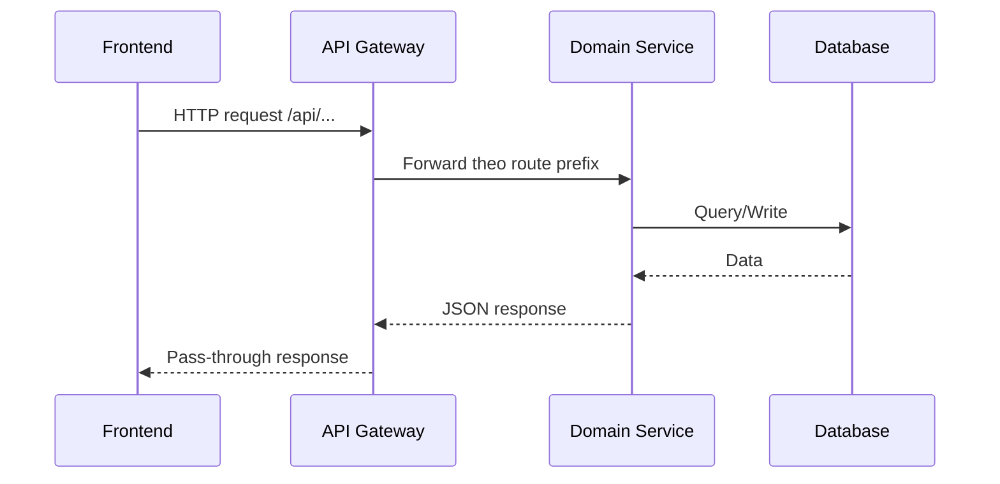
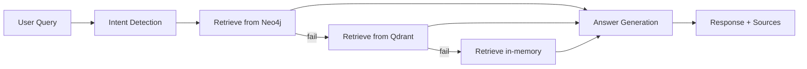
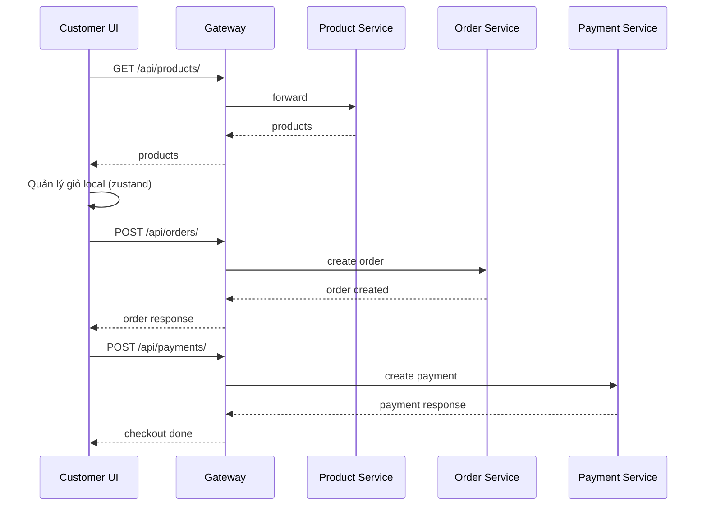

# Phân Tích Và Thiết Kế Hệ Thống Ecommerce AI

## 1. Mục tiêu tài liệu

Tài liệu mô tả phân tích hệ thống và thiết kế kiến trúc của project `ecommerce_ai` theo hiện trạng code (as-is), đồng thời nêu các hướng hoàn thiện (to-be) để dễ mở rộng.

## 2. Phạm vi hệ thống

- Frontend: React/Vite (`frontend`, port `3001`)
- Backend Gateway: Django proxy (`api_gateway`, port `8000`)
- Microservices nghiệp vụ:
  - `user_service` (`8101`)
  - `product_service` (`8102`)
  - `order_service` (`8103`)
  - `cart_service` (`8106`)
  - `payment_service` (`8107`)
  - `shipping_service` (`8108`)
- AI services:
  - `behavior_service` (`8104`) - gợi ý theo hành vi
  - `rag_chat_service` (`8105`) - chatbot tư vấn sản phẩm
- Hạ tầng dữ liệu:
  - `mysql_db` cho user
  - `postgres_db` cho product/order/cart/payment/shipping
  - `neo4j_db`, `vector_db (Qdrant)` cho RAG

## 3. Kiến trúc tổng thể



### 3.1 Đặc điểm kiến trúc

- Kiến trúc microservices, giao tiếp HTTP đồng bộ qua gateway.
- Gateway đóng vai trò reverse proxy theo route prefix, chưa có auth tập trung.
- Mỗi domain service tách riêng, dễ scale độc lập theo tải.
- AI tách riêng thành 2 service: inference hành vi và retrieval/chat.

## 4. Thiết kế domain (bounded context)



## 5. Thiết kế dữ liệu mức service

### 5.1 User Service

- Nhóm thực thể: `AdminUser`, `StaffUser`, `Customer`
- Mục tiêu: đăng nhập theo role, quản lý user theo vai trò

### 5.2 Product Service

- Thực thể chính: `Product`
- Thuộc tính nổi bật: `name`, `category`, `price`, `ai_match`, `image_icon`

### 5.3 Order Service

- `Order`: `order_number`, `customer_name`, `customer_email`, `status`, `payment_status`, `shipping_status`, `total_amount`, `created_at`
- `OrderItem`: `order`, `product_id`, `product_name`, `unit_price`, `quantity`

### 5.4 Cart Service

- `Cart`: `customer_name`, `customer_email`, `item_count`, `total_amount`, `status`, `notes`, `created_at`
- `CartItem`: `cart`, `product_id`, `product_name`, `unit_price`, `quantity`

### 5.5 Payment Service

- `Payment`: `order_number`, `customer_name`, `amount`, `method`, `status`, `transaction_ref`, `created_at`

### 5.6 Shipping Service

- `Shipment`: `order_number`, `carrier`, `tracking_number`, `shipping_status`, `destination`, `eta_days`, `created_at`

## 6. Thiết kế API Gateway

Gateway map request theo prefix:

- `/api/products/**` -> `product_service`
- `/api/behavior/recommend/` -> `behavior_service`
- `/api/chat/**` -> `rag_chat_service`
- `/api/users/**` -> `user_service`
- `/api/orders/**` -> `order_service`
- `/api/carts/**` -> `cart_service`
- `/api/payments/**` -> `payment_service`
- `/api/shipments/**` -> `shipping_service`



## 7. Thiết kế AI

### 7.1 Behavior Recommendation Service

- Input: `recent_actions`
- Pipeline:
  1. Encode hành vi -> sequence `(1, 10, 1)`
  2. Inference với model LSTM (`model_lstm.h5`)
  3. Suy ra `predicted_next_action`
  4. Map action -> intent -> category -> product recommendation
- Output: `predicted_next_action`, `confidence`, `intent`, `recommended_product_ids`, `recommendations`

### 7.2 RAG Chat Service

- Ưu tiên backend truy xuất: `Neo4j` -> fallback `Qdrant` -> fallback `in_memory`
- Chức năng chính:
  - Seed knowledge graph từ products/bundles
  - Detect intent query
  - Retrieve tài liệu liên quan
  - Generate câu trả lời + nguồn tham chiếu



## 8. Luồng nghiệp vụ chính

### 8.1 Luồng mua hàng hiện tại



Ghi chú: frontend hiện đang giữ cart local store, chưa orchestration đầy đủ với `cart_service` và `shipping_service` trong checkout.

## 9. Đánh giá kiến trúc As-Is

### 9.1 Điểm tốt

- Tách service theo domain khá rõ.
- Có API Gateway thống nhất entrypoint backend.
- AI được tách độc lập khỏi core commerce.
- Dễ chạy local bằng `docker-compose`.

### 9.2 Hạn chế kỹ thuật

- Gateway mới chỉ proxy, chưa có:
  - xác thực tập trung (JWT verification)
  - rate limit / circuit breaker / retry policy
  - quan sát tập trung (trace-id, metrics chuẩn)
- Checkout là chuỗi call rời, chưa có Saga/Orchestration.
- Nhất quán dữ liệu liên service phụ thuộc vào client flow.
- Frontend chưa dùng `cart_service` như source of truth.

## 10. Thiết kế mục tiêu (To-Be)

### 10.1 Kiến trúc đề xuất

```mermaid
flowchart TB
    FE[Frontend]
    APIGW[API Gateway + Auth + Rate Limit]
    ORCH[Checkout Orchestrator\n(Saga)]

    US[user_service]
    PS[product_service]
    CS[cart_service]
    OS[order_service]
    PAY[payment_service]
    SH[shipping_service]

    BUS[(Event Bus)]

    FE --> APIGW
    APIGW --> US
    APIGW --> PS
    APIGW --> CS
    APIGW --> ORCH

    ORCH --> OS
    ORCH --> PAY
    ORCH --> SH

    OS <--> BUS
    PAY <--> BUS
    SH <--> BUS
```

### 10.2 Hướng nâng cấp ưu tiên

1. Chuẩn hóa auth token xuyên gateway và services.
2. Chuyển cart từ local-only sang đồng bộ `cart_service`.
3. Tạo checkout orchestration (Saga) để đảm bảo trạng thái order/payment/shipping nhất quán.
4. Bổ sung observability: structured logs, request-id, metrics, tracing.
5. Viết contract test cho gateway và integration test cho flow checkout.

## 11. Kết luận

Project đã có nền tảng microservices + AI khá rõ ràng cho demo thực chiến. Để lên mức production-ready, trọng tâm là: auth tập trung, orchestration checkout, đồng bộ dữ liệu liên service và tăng khả năng quan sát vận hành.
