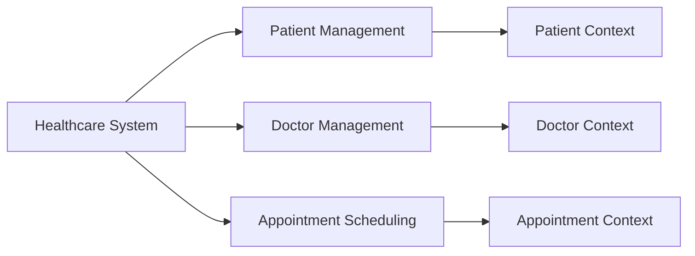
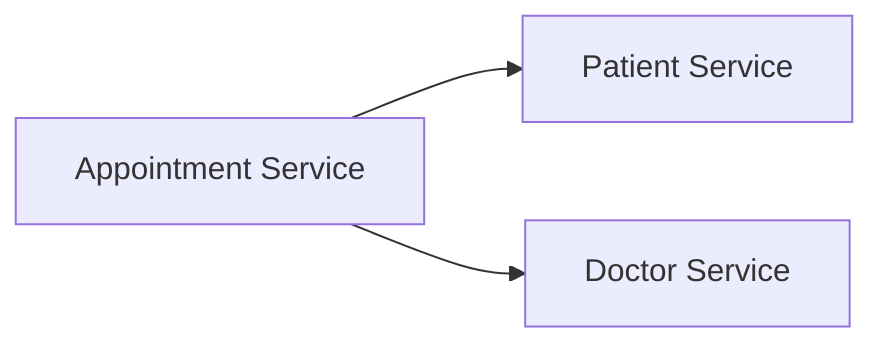

# Chương 1. Từ Monolithic đến Microservices và DDD

## 1.1 Giới thiệu Monolithic Architecture

### 1.1.1 Khái niệm

Monolithic Architecture là mô hình kiến trúc trong đó toàn bộ hệ thống phần mềm được xây dựng, chạy và triển khai như một khối thống nhất. Các thành phần như giao diện người dùng, xử lý nghiệp vụ, truy cập dữ liệu và tích hợp hệ thống thường cùng nằm trong một codebase, dùng chung cơ sở dữ liệu và được phát hành trong một lần deploy.

Với cách tiếp cận này, ứng dụng thường dễ khởi đầu vì cấu trúc tập trung, dễ debug ở giai đoạn đầu và không cần xử lý nhiều bài toán phân tán. Đây là mô hình phổ biến khi nhóm phát triển muốn nhanh chóng tạo ra một sản phẩm mẫu hoặc một hệ thống có phạm vi nghiệp vụ chưa quá lớn.

### 1.1.2 Cấu trúc điển hình

Một hệ monolithic thường gồm ba lớp chính:

- `Presentation Layer`: giao diện web, mobile hoặc API endpoint tiếp nhận request từ người dùng.
- `Business Logic Layer`: nơi chứa các quy tắc nghiệp vụ như tính giá, xử lý đơn hàng, kiểm tra quyền truy cập.
- `Data Access Layer`: truy xuất cơ sở dữ liệu, đọc và ghi dữ liệu nghiệp vụ.

Ba lớp này có thể được tổ chức tương đối tách biệt trong mã nguồn, nhưng về mặt triển khai chúng vẫn thuộc cùng một ứng dụng. Khi cần cập nhật một phần nhỏ, toàn bộ hệ thống thường phải build và deploy lại.

### 1.1.3 Ví dụ thực tế

Trong một hệ thống thương mại điện tử, nếu áp dụng monolithic architecture thì các chức năng như:

- quản lý người dùng
- quản lý sản phẩm
- giỏ hàng
- đơn hàng
- thanh toán
- giao hàng

sẽ cùng tồn tại trong một project duy nhất. Toàn bộ luồng nghiệp vụ được xử lý trong một ứng dụng và thường chia sẻ cùng một cơ sở dữ liệu trung tâm.

Nếu đặt trong bối cảnh đề tài hiện tại, một phiên bản monolithic của `ecommerce_ai` có thể là một Django project duy nhất, trong đó tất cả các module `user`, `product`, `cart`, `order`, `payment`, `shipping` và cả phần AI cùng nằm trong một codebase. Cách làm này phù hợp khi mới bắt đầu, nhưng sẽ bộc lộ nhiều giới hạn khi hệ thống và số lượng thành viên tăng lên.

### 1.1.4 Nhược điểm chi tiết

Mặc dù monolithic đơn giản ở giai đoạn đầu, mô hình này có nhiều hạn chế khi hệ thống mở rộng:

- Khó mở rộng linh hoạt: khi một chức năng chịu tải lớn, ví dụ catalog sản phẩm hoặc tìm kiếm, hệ thống vẫn phải scale cả ứng dụng thay vì chỉ scale riêng phần cần thiết.
- Coupling cao: các module dùng chung codebase và thường phụ thuộc lẫn nhau, nên thay đổi nhỏ ở một khu vực có thể ảnh hưởng sang nhiều khu vực khác.
- Deploy rủi ro: chỉ một lỗi nhỏ trong một module cũng có thể khiến toàn bộ hệ thống deploy thất bại hoặc ngừng hoạt động.
- Khó phát triển song song: khi nhiều nhóm cùng làm việc trên một codebase lớn, xung đột merge, phụ thuộc release và rủi ro regression thường tăng lên.
- Công nghệ bị ràng buộc: toàn hệ thống thường phải dùng cùng một stack kỹ thuật, gây khó khăn nếu muốn tối ưu từng bài toán bằng công nghệ khác nhau.

### 1.1.5 Khi nào nên dùng Monolithic

Monolithic vẫn là lựa chọn hợp lý trong nhiều trường hợp:

- hệ thống nhỏ hoặc phạm vi nghiệp vụ hẹp
- sản phẩm đang ở giai đoạn `MVP`
- team ít người, cần đi nhanh
- yêu cầu vận hành chưa phức tạp
- chưa có nhu cầu scale độc lập từng thành phần

Nói cách khác, monolithic không phải là mô hình "sai", mà là mô hình phù hợp với giai đoạn đầu của nhiều dự án. Vấn đề chỉ xuất hiện khi kiến trúc này tiếp tục được giữ nguyên dù độ phức tạp nghiệp vụ đã tăng cao.

## 1.2 Microservices Architecture

### 1.2.1 Khái niệm

Microservices Architecture là mô hình chia hệ thống thành nhiều dịch vụ nhỏ, độc lập, mỗi service phụ trách một năng lực nghiệp vụ tương đối rõ ràng. Mỗi service có thể được phát triển, triển khai và mở rộng riêng, đồng thời giao tiếp với các service khác thông qua API hoặc cơ chế message.

Tư tưởng cốt lõi của microservices là tách hệ thống theo domain nghiệp vụ thay vì gom toàn bộ logic vào một ứng dụng duy nhất. Điều này làm giảm sự phụ thuộc chặt giữa các phần và tạo điều kiện để mở rộng hệ thống theo chiều ngang.

### 1.2.2 Đặc điểm

Kiến trúc microservices thường có các đặc điểm sau:

- mỗi service có trách nhiệm riêng, tập trung vào một domain cụ thể
- mỗi service có thể có cơ sở dữ liệu riêng
- giao tiếp giữa các service thông qua `REST`, `gRPC` hoặc message queue
- deploy độc lập từng service
- có thể scale riêng service chịu tải cao

Trong project `ecommerce_ai`, cách tổ chức hiện tại đã đi theo hướng này với các service như `user_service`, `product_service`, `cart_service`, `order_service`, `payment_service`, `shipping_service`, `behavior_service`, `rag_chat_service` và `api_gateway`.

### 1.2.3 So sánh Monolithic vs Microservices

| Tiêu chí | Monolithic | Microservices |
|---|---|---|
| Phạm vi deploy | Một lần cho toàn hệ thống | Từng service độc lập |
| Khả năng scale | Scale cả hệ thống | Scale theo từng service |
| Mức độ coupling | Cao | Thấp hơn nếu tách đúng domain |
| Quản trị vận hành | Đơn giản hơn lúc đầu | Phức tạp hơn do hệ phân tán |
| Tốc độ phát triển dài hạn | Dễ chậm lại khi hệ thống lớn | Tốt hơn nếu có ranh giới rõ |

Monolithic phù hợp khi muốn tối giản kỹ thuật và đi nhanh ở giai đoạn đầu. Ngược lại, microservices phù hợp hơn khi hệ thống có nhiều domain, nhiều nhóm phát triển và yêu cầu mở rộng lâu dài.

### 1.2.4 Ưu điểm

Microservices mang lại nhiều lợi ích đáng kể:

- mở rộng độc lập từng service theo tải thực tế
- giảm ảnh hưởng dây chuyền khi thay đổi một chức năng
- cho phép nhiều nhóm phát triển song song
- dễ tối ưu công nghệ theo từng bài toán
- tăng khả năng cô lập lỗi, tránh làm sập toàn hệ thống

Ví dụ, trong hệ thống ecommerce có tích hợp AI, phần `behavior_service` hoặc `rag_chat_service` có thể cần tài nguyên xử lý khác với các service CRUD truyền thống. Tách riêng các service AI giúp triển khai và scale hợp lý hơn so với đặt tất cả trong một ứng dụng chung.

### 1.2.5 Nhược điểm

Bên cạnh ưu điểm, microservices cũng làm hệ thống phức tạp hơn:

- khó quản lý hơn do phải vận hành nhiều service
- cần xử lý bài toán distributed system như timeout, retry, fault tolerance
- debug khó hơn vì luồng request đi qua nhiều thành phần
- yêu cầu giám sát, logging và tracing tốt hơn
- đòi hỏi kỷ luật thiết kế cao, nếu tách sai sẽ tạo ra nhiều service nhưng vẫn coupling mạnh

Điều này cho thấy microservices không chỉ là việc "chia nhỏ code", mà là thay đổi cả cách thiết kế, cách triển khai và cách vận hành hệ thống.

### 1.2.6 Nguyên tắc thiết kế

Khi thiết kế microservices cần tuân thủ một số nguyên tắc nền tảng:

- `Single Responsibility`: mỗi service chỉ nên tập trung vào một nhóm trách nhiệm nghiệp vụ chính.
- `Loose Coupling`: các service giao tiếp qua hợp đồng rõ ràng, hạn chế phụ thuộc nội bộ.
- `High Cohesion`: logic bên trong một service cần liên quan chặt chẽ tới cùng một domain.
- `Database per Service`: mỗi service tự quản lý dữ liệu của mình, tránh dùng chung database toàn hệ thống.
- `Independent Deployment`: có thể phát hành từng service mà không buộc phải phát hành cả hệ.

Nếu áp dụng đúng, hệ thống sẽ linh hoạt hơn nhiều so với monolithic. Nếu áp dụng sai, microservices có thể trở thành một hệ thống phân tán phức tạp nhưng không mang lại giá trị tương xứng.

## 1.3 Domain Driven Design (DDD)

### 1.3.1 Mục tiêu

Domain Driven Design là phương pháp tiếp cận thiết kế phần mềm dựa trên việc mô hình hóa đúng nghiệp vụ cốt lõi của hệ thống. Mục tiêu của DDD là đưa ngôn ngữ nghiệp vụ trở thành trung tâm của thiết kế, giúp hệ thống phản ánh đúng cách domain vận hành thay vì chỉ tổ chức code theo tầng kỹ thuật.

DDD đặc biệt phù hợp với các hệ thống có nghiệp vụ lớn, nhiều quy tắc xử lý và cần phân rã thành nhiều service. Trong bối cảnh microservices, DDD giúp trả lời câu hỏi quan trọng nhất: nên chia hệ thống theo ranh giới nào.

### 1.3.2 Các khái niệm cốt lõi

`Entity` là đối tượng có định danh riêng và được theo dõi xuyên suốt vòng đời.

- Ví dụ: `User`, `Product`, `Order`

`Value Object` là đối tượng không có định danh độc lập, được so sánh bằng giá trị.

- Ví dụ: `Address`, `Money`, `Dimension`

`Aggregate` là một cụm entity và value object liên quan chặt chẽ, được quản lý như một đơn vị nhất quán nghiệp vụ.

- Ví dụ: `Order` và danh sách `OrderItem`

`Bounded Context` là ranh giới nơi một mô hình domain có ý nghĩa rõ ràng và nhất quán.

- Ví dụ: `User Context`, `Catalog Context`, `Order Context`, `Payment Context`

Các khái niệm này giúp tránh việc dùng cùng một mô hình dữ liệu cho mọi nơi. Chẳng hạn, khái niệm "user" trong xác thực có thể khác với "customer" trong đơn hàng hoặc "staff" trong vận hành, nên cần xem xét ranh giới domain thay vì gộp tất cả thành một model duy nhất.

### 1.3.3 Context Map

`Context Map` là sơ đồ mô tả các bounded context và quan hệ giữa chúng. Đây là công cụ quan trọng để phân tích hệ thống trước khi tách thành microservices.

Một context map cơ bản cho hệ thống ecommerce có thể gồm:

- `User Context`
- `Product Context`
- `Cart Context`
- `Order Context`
- `Payment Context`
- `Shipping Context`
- `AI Recommendation Context`
- `AI Advisory Context`

Giữa các context có thể tồn tại các quan hệ như:

- `Customer-Supplier`: `Order Context` phụ thuộc dữ liệu từ `User Context` và `Product Context`
- `Shared Kernel`: một số khái niệm dùng chung có kiểm soát, ví dụ mã định danh sản phẩm hoặc quy ước trạng thái

Việc vẽ context map trước khi thiết kế chi tiết giúp tránh nhầm lẫn giữa ranh giới nghiệp vụ với ranh giới kỹ thuật.

### 1.3.4 DDD trong Microservices

DDD là nền tảng tự nhiên để phân rã microservices vì:

- mỗi `Bounded Context` có thể ánh xạ thành một microservice
- service được chia theo nghiệp vụ, không chia theo technical layer
- giảm coupling giữa các phần không thuộc cùng domain
- giúp mỗi service sở hữu mô hình dữ liệu và ngôn ngữ nghiệp vụ riêng

Đối với project `ecommerce_ai`, có thể thấy hướng phân rã hiện tại tương đối phù hợp với tư tưởng DDD: `product_service` quản lý catalog, `order_service` quản lý vòng đời đơn hàng, `payment_service` xử lý thanh toán, còn hai service AI được tách ra để giải quyết năng lực tư vấn và gợi ý.

## 1.4 Case Study: Healthcare (Luyện Decomposition)

### 1.4.1 Mô tả bài toán

Xét một hệ thống quản lý bệnh viện với ba nhóm chức năng chính:

- quản lý bệnh nhân
- quản lý bác sĩ
- đặt lịch khám

Nếu thiết kế theo kiểu monolithic, toàn bộ chức năng này có thể nằm trong một ứng dụng duy nhất. Tuy nhiên, để luyện tư duy decomposition theo DDD và microservices, ta sẽ phân tích bài toán theo domain.

### 1.4.2 Bước 1: Xác định Domain

Từ yêu cầu bài toán, có thể xác định ba domain chính:

- `Patient Management`
- `Doctor Management`
- `Appointment Scheduling`

Mỗi domain có quy tắc nghiệp vụ và dữ liệu lõi khác nhau. Bệnh nhân tập trung vào hồ sơ cá nhân và lịch sử khám; bác sĩ tập trung vào chuyên môn, lịch làm việc; đặt lịch tập trung vào việc kết nối bệnh nhân với bác sĩ theo thời gian cụ thể.

### 1.4.3 Bước 2: Xác định Bounded Context

Từ ba domain trên, ta xác định ba bounded context tương ứng:

- `Patient Context`
- `Doctor Context`
- `Appointment Context`

Đây là bước rất quan trọng vì nó xác lập ranh giới mô hình. Ví dụ, thông tin bệnh nhân không nên bị nhúng toàn bộ vào context đặt lịch, mà chỉ nên tham chiếu qua định danh hoặc contract cần thiết.

Hình 1.1 dưới đây minh họa cách phân rã từ domain sang bounded context:



### 1.4.4 Bước 3: Phân rã thành Microservices

Sau khi có bounded context, có thể phân rã thành các service:

- `Patient Service`
- `Doctor Service`
- `Appointment Service`

Mỗi service chịu trách nhiệm cho dữ liệu và nghiệp vụ của riêng mình. `Appointment Service` không quản lý hồ sơ bác sĩ hay bệnh nhân một cách đầy đủ, mà chỉ sử dụng thông tin cần thiết để tạo lịch khám.

Có thể minh họa quan hệ service như sau:



### 1.4.5 Bước 4: Xác định quan hệ

Quan hệ giữa các service có thể mô tả như sau:

- `Appointment Service` phụ thuộc vào `Patient Service` để xác thực bệnh nhân
- `Appointment Service` phụ thuộc vào `Doctor Service` để kiểm tra bác sĩ và lịch làm việc
- giao tiếp giữa các service được thực hiện thông qua API

Điểm quan trọng ở đây là phụ thuộc nghiệp vụ vẫn tồn tại, nhưng phụ thuộc triển khai phải được kiểm soát. Một service không được truy cập trực tiếp database của service khác nếu muốn giữ đúng tinh thần microservices.

### 1.4.6 Ví dụ API

Một số API minh họa:

```http
GET /patients
GET /doctors
POST /appointments
```

Ba endpoint trên thể hiện rõ việc mỗi service cung cấp khả năng truy cập theo trách nhiệm của riêng nó. Đây cũng chính là tư duy cần áp dụng khi phân rã hệ thống ecommerce: tách theo domain, xác định quan hệ, rồi mới thiết kế contract giao tiếp.

## 1.5 Kết luận

Monolithic architecture phù hợp với hệ thống nhỏ, team nhỏ và giai đoạn cần đi nhanh. Tuy nhiên, khi nghiệp vụ mở rộng, số lượng thành phần tăng và yêu cầu scale độc lập xuất hiện, mô hình này dễ trở thành điểm nghẽn.

Microservices architecture cung cấp cách tổ chức linh hoạt hơn bằng việc chia hệ thống thành các service độc lập theo domain. Dù phức tạp hơn về triển khai và vận hành, mô hình này phù hợp với các hệ thống lớn, nhiều nhóm phát triển và cần khả năng mở rộng dài hạn.

Trong quá trình chuyển đổi từ monolithic sang microservices, `Domain Driven Design` đóng vai trò nền tảng vì nó giúp xác định đúng ranh giới nghiệp vụ. Với đề tài `ecommerce_ai`, việc hiểu rõ ba nội dung này là bước chuẩn bị cần thiết trước khi đi vào phân rã hệ thống, thiết kế service và xây dựng kiến trúc tổng thể ở các chương tiếp theo.
