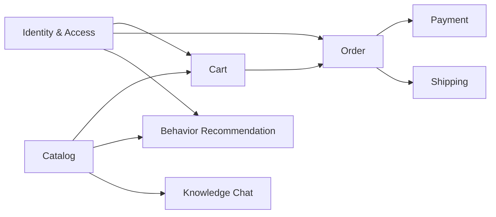
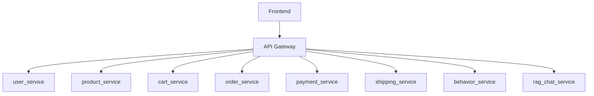
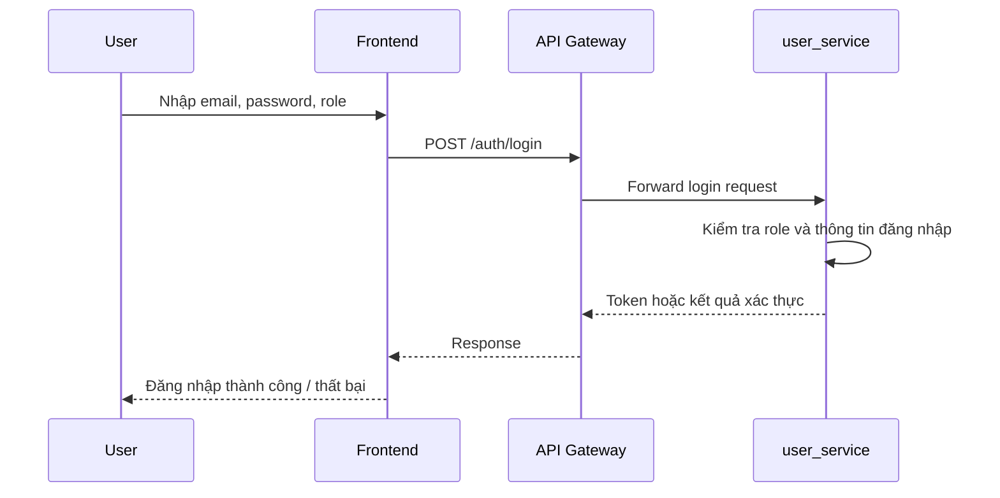
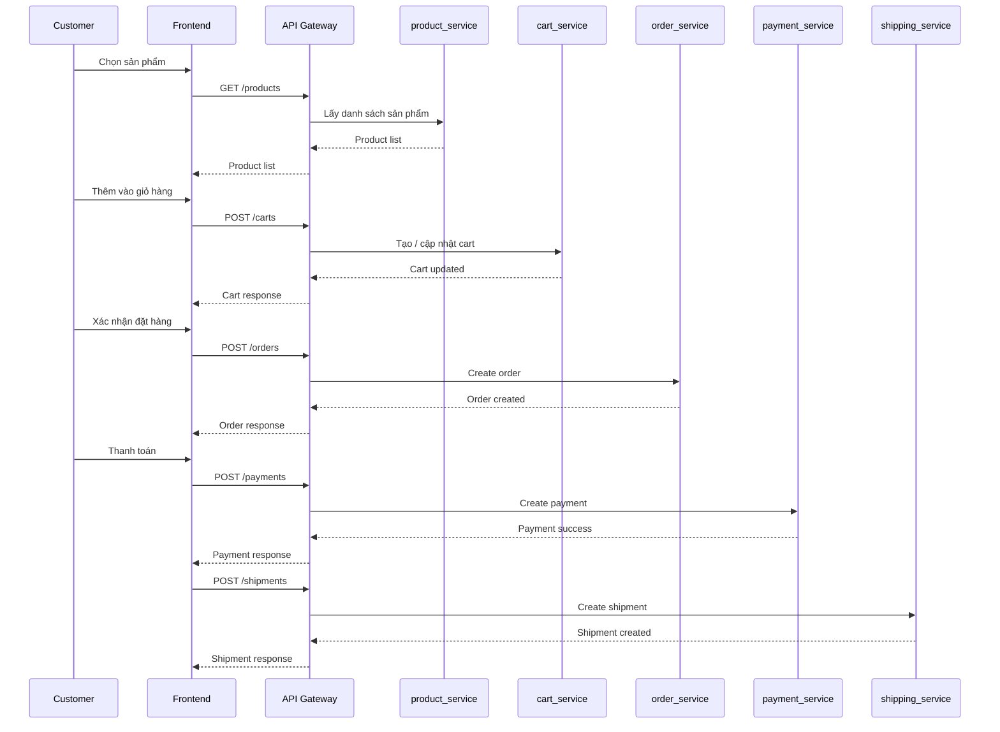
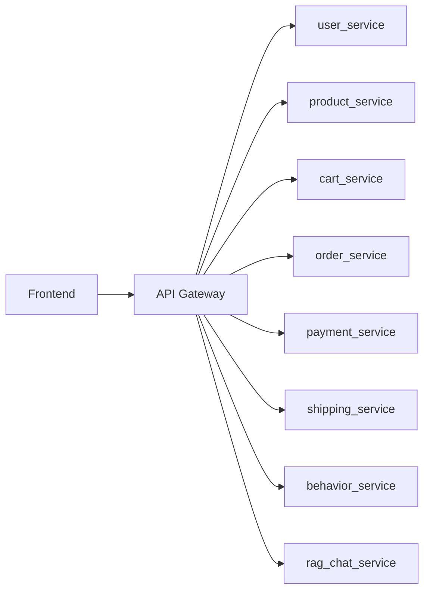

# Chương 2. Phát triển Hệ E-Commerce Microservices

## 2.1 Xác định yêu cầu

### 2.1.1 Functional Requirements

Hệ thống `ecommerce_ai` cần hỗ trợ các chức năng nghiệp vụ chính sau:

- quản lý người dùng theo vai trò `admin`, `staff`, `customer`
- quản lý danh mục sản phẩm và thông tin catalog
- cho phép người dùng xem sản phẩm và tìm kiếm sản phẩm
- thêm sản phẩm vào giỏ hàng
- tạo đơn hàng từ nhu cầu mua sắm của khách hàng
- ghi nhận thanh toán và trạng thái thanh toán
- theo dõi trạng thái giao hàng
- hỗ trợ gợi ý sản phẩm bằng AI
- hỗ trợ chatbot tư vấn sản phẩm

Xét theo hiện trạng project, các chức năng trên được tách thành các service riêng như `user_service`, `product_service`, `cart_service`, `order_service`, `payment_service`, `shipping_service`, `behavior_service` và `rag_chat_service`.

### 2.1.2 Non-functional Requirements

Ngoài chức năng nghiệp vụ, hệ thống cần đáp ứng các yêu cầu phi chức năng sau:

- `Scalability`: có thể mở rộng từng service độc lập thay vì scale toàn hệ thống
- `Maintainability`: dễ bảo trì nhờ tách riêng theo domain
- `Availability`: lỗi ở một service không làm sập toàn bộ hệ thống
- `Security`: có kiểm soát truy cập và phân quyền theo vai trò người dùng
- `Extensibility`: dễ bổ sung service AI hoặc service nghiệp vụ mới
- `Deployability`: từng service có thể build và triển khai độc lập

## 2.2 Phân rã hệ thống theo DDD

### 2.2.1 Bounded Context

Hệ thống được phân rã theo các bounded context sau:

- `User Context`
- `Product Context`
- `Cart Context`
- `Order Context`
- `Payment Context`
- `Shipping Context`
- `Behavior Recommendation Context`
- `RAG Advisory Context`

Sơ đồ phân rã domain và bounded context:

### 2.2.2 Hình phân rã thành các service

Từ các bounded context, hệ thống được triển khai thành các service tương ứng như sau:

Hình trên là hình phân rã quan trọng của Chương 2 và hoàn toàn có thể dùng `mermaid`. Đây là sơ đồ mức kiến trúc khối nên không cần dùng `Visual Paradigm`.

### 2.2.3 Nguyên tắc phân rã

Việc phân rã hệ thống dựa trên các nguyên tắc sau:

- mỗi service chỉ phụ trách một domain nghiệp vụ chính
- mỗi service có thể có database riêng
- giao tiếp giữa các service thông qua API
- không truy cập trực tiếp database của service khác
- AI service được tách riêng khỏi các service giao dịch truyền thống

## 2.3 Thiết kế Product Service

### 2.3.1 Vai trò

`product_service` chịu trách nhiệm quản lý catalog sản phẩm, bao gồm tên sản phẩm, nhóm sản phẩm, giá và một số thuộc tính phục vụ AI như `ai_match`, `image_icon`.

### 2.3.2 Model hiện tại trong project

Model chính của `product_service` hiện tại là `Product` với các thuộc tính:

- `name`
- `category`
- `price`
- `ai_match`
- `image_icon`

### 2.3.3 Gợi ý biểu đồ lớp thiết kế

Phần này nên vẽ bằng `Visual Paradigm` vì đây là một trong các class diagram chính của bài nộp.

Biểu đồ lớp nên có tối thiểu:

- class `Product`
- các thuộc tính `id`, `name`, `category`, `price`, `ai_match`, `image_icon`

Nếu muốn làm đầy hơn theo đúng tinh thần PDF, có thể mở rộng thêm các class:

- `Category`
- `Book`
- `Electronics`
- `Fashion`

Tuy nhiên, cần ghi chú rõ đây là thiết kế mục tiêu (`To-Be`) vì code hiện tại mới có `Product`.

`[Cần chèn Class Diagram Product Service vẽ bằng Visual Paradigm]`

### 2.3.4 API chính

- `GET /products/`
- `POST /products/`
- `GET /products/{id}`

## 2.4 Thiết kế User Service

### 2.4.1 Vai trò

`user_service` quản lý người dùng theo ba vai trò riêng biệt:

- `AdminUser`
- `StaffUser`
- `Customer`

### 2.4.2 Model hiện tại trong project

Code hiện tại có một abstract base là `TimestampedModel` và ba model chính:

- `AdminUser`
- `StaffUser`
- `Customer`

Các thuộc tính dùng chung gồm:

- `full_name`
- `email`
- `password`
- `phone`
- `is_active`
- `created_at`
- `updated_at`

Thuộc tính riêng:

- `AdminUser`: `permissions_scope`
- `StaffUser`: `department`, `shift`
- `Customer`: `loyalty_tier`, `default_address`

### 2.4.3 Gợi ý biểu đồ lớp thiết kế

Phần này nên vẽ bằng `Visual Paradigm` vì có yếu tố kế thừa, rất phù hợp để thể hiện bằng UML class diagram.

Biểu đồ nên có:

- `TimestampedModel` là lớp cha trừu tượng
- `AdminUser`, `StaffUser`, `Customer` kế thừa từ `TimestampedModel`
- thể hiện rõ các thuộc tính chung và thuộc tính riêng

`[Cần chèn Class Diagram User Service vẽ bằng Visual Paradigm]`

### 2.4.4 Phân quyền

Phân quyền nghiệp vụ của hệ thống có thể mô tả như sau:

- `Admin`: quản trị hệ thống, xem thống kê, quản lý cấu hình
- `Staff`: xử lý vận hành đơn hàng và hỗ trợ quy trình giao hàng
- `Customer`: xem sản phẩm, mua hàng, theo dõi đơn hàng

### 2.4.5 API chính

- `POST /auth/login`
- `GET /users/summary`
- `GET /customers/`
- `GET /staff-users/`
- `GET /admin-users/`

## 2.5 Thiết kế Cart Service

### 2.5.1 Vai trò

`cart_service` lưu thông tin giỏ hàng của khách hàng trong quá trình mua sắm.

### 2.5.2 Model hiện tại trong project

Model hiện tại gồm hai lớp `Cart` và `CartItem`.

`Cart` có các thuộc tính:

- `customer_name`
- `customer_email`
- `item_count`
- `total_amount`
- `status`
- `notes`
- `created_at`

`CartItem` có các thuộc tính:

- `product_id`
- `product_name`
- `unit_price`
- `quantity`
- `cart`

### 2.5.3 Gợi ý biểu đồ lớp thiết kế

Phần này nên vẽ bằng `Visual Paradigm`. Nếu bám đúng code hiện tại, class diagram cần có:

- `Cart`
- `CartItem`

Quan hệ cần thể hiện:

- một `Cart` có nhiều `CartItem`
- một `CartItem` thuộc về đúng một `Cart`

`[Cần chèn Class Diagram Cart Service vẽ bằng Visual Paradigm]`

### 2.5.4 API chính

- `GET /carts/`
- `POST /carts/`
- `GET /carts/{id}`

## 2.6 Thiết kế Order Service

### 2.6.1 Vai trò

`order_service` quản lý vòng đời đơn hàng sau khi khách hàng xác nhận mua hàng.

### 2.6.2 Model hiện tại trong project

Model hiện tại gồm hai lớp `Order` và `OrderItem`.

`Order` với các thuộc tính:

- `order_number`
- `customer_name`
- `customer_email`
- `status`
- `payment_status`
- `shipping_status`
- `total_amount`
- `created_at`

`OrderItem` với các thuộc tính:

- `product_id`
- `product_name`
- `unit_price`
- `quantity`
- `order`

### 2.6.3 Gợi ý biểu đồ lớp thiết kế

Phần này nên vẽ bằng `Visual Paradigm`.

Nếu bám theo code hiện tại, class diagram cần có:

- `Order`
- `OrderItem`

Quan hệ cần thể hiện:

- một `Order` có nhiều `OrderItem`
- một `OrderItem` thuộc về đúng một `Order`

`[Cần chèn Class Diagram Order Service vẽ bằng Visual Paradigm]`

### 2.6.4 API chính

- `GET /orders/`
- `POST /orders/`
- `PATCH /orders/{id}`

## 2.7 Thiết kế Payment Service

### 2.7.1 Vai trò

`payment_service` lưu giao dịch thanh toán tương ứng với đơn hàng.

### 2.7.2 Model hiện tại trong project

Model `Payment` gồm:

- `order_number`
- `customer_name`
- `amount`
- `method`
- `status`
- `transaction_ref`
- `created_at`

### 2.7.3 Gợi ý biểu đồ lớp thiết kế

Service này khá đơn giản. Nếu cần tiết kiệm thời gian, bạn vẫn nên vẽ bằng `Visual Paradigm` để đồng bộ với các service khác, nhưng sơ đồ sẽ rất gọn.

Biểu đồ chỉ cần:

- `Payment`

`[Cần chèn Class Diagram Payment Service vẽ bằng Visual Paradigm]`

### 2.7.4 API chính

- `GET /payments/`
- `POST /payments/`
- `GET /payments/{id}`

## 2.8 Thiết kế Shipping Service

### 2.8.1 Vai trò

`shipping_service` quản lý thông tin vận chuyển và trạng thái giao hàng.

### 2.8.2 Model hiện tại trong project

Model `Shipment` gồm:

- `order_number`
- `carrier`
- `tracking_number`
- `shipping_status`
- `destination`
- `eta_days`
- `created_at`

### 2.8.3 Gợi ý biểu đồ lớp thiết kế

Tương tự `payment_service`, phần này có thể vẽ khá đơn giản bằng `Visual Paradigm`.

Biểu đồ chỉ cần:

- `Shipment`

`[Cần chèn Class Diagram Shipping Service vẽ bằng Visual Paradigm]`

### 2.8.4 API chính

- `GET /shipments/`
- `POST /shipments/`
- `GET /shipments/{id}`

## 2.9 Luồng hệ thống tổng thể

Luồng nghiệp vụ mua hàng tổng thể của hệ thống có thể mô tả như sau:

Sơ đồ trên phù hợp để dùng `mermaid` vì đây là flow nghiệp vụ mức cao.

## 2.10 Biểu đồ luồng xử lý quan trọng

### 2.10.1 Luồng đăng nhập

### 2.10.2 Luồng mua hàng

Đây là biểu đồ luồng xử lý quan trọng nhất của Chương 2, bắt buộc nên có.

### 2.10.3 Luồng giao tiếp giữa các service

### 2.10.4 Lưu ý về biểu đồ

Các biểu đồ sau có thể nộp bằng `mermaid`:

- hình phân rã service
- bounded context map
- luồng tổng thể hệ thống
- sequence đăng nhập
- sequence mua hàng
- sơ đồ giao tiếp giữa các service

Các biểu đồ sau nên vẽ bằng `Visual Paradigm`:

- class diagram của `User Service`
- class diagram của `Product Service`
- class diagram của `Cart Service`
- class diagram của `Order Service`
- class diagram của `Payment Service`
- class diagram của `Shipping Service`

## 2.11 Hướng dẫn phần hình cần tự vẽ bằng Visual Paradigm

Để bài nộp đúng yêu cầu của thầy, phần class diagram nên được vẽ riêng bằng `Visual Paradigm` rồi chèn ảnh vào tài liệu Word sau khi convert từ Markdown.

Thứ tự ưu tiên nên vẽ:

1. `User Service`
2. `Product Service`
3. `Cart Service`
4. `Order Service`
5. `Payment Service`
6. `Shipping Service`

Nếu cần làm nhanh, có thể dùng các gợi ý sau:

- `User Service`: dùng mô hình kế thừa giữa `TimestampedModel` và ba lớp người dùng
- `Product Service`: vẽ `Product`, có thể mở rộng thêm `Category` nếu muốn đẹp hơn
- `Cart Service`: vẽ `Cart`, nếu muốn mạnh hơn thì bổ sung `CartItem`
- `Order Service`: vẽ `Order`, nếu muốn đầy đủ hơn thì bổ sung `OrderItem`
- `Payment Service`: vẽ `Payment`
- `Shipping Service`: vẽ `Shipment`

## 2.12 Kết luận

Chương 2 cho thấy hệ thống `ecommerce_ai` đã được phân rã theo hướng microservices tương đối rõ ràng, mỗi service phụ trách một domain nghiệp vụ riêng. Phần quan trọng nhất của chương này không chỉ là mô tả service, mà còn phải thể hiện được hình phân rã, class diagram thiết kế và các luồng xử lý chính như đăng nhập và mua hàng.

Về mặt trình bày, các sơ đồ mức kiến trúc và luồng xử lý có thể thể hiện tốt bằng `mermaid`. Tuy nhiên, các class diagram của từng service nên được vẽ bằng `Visual Paradigm` để đáp ứng tốt hơn yêu cầu học phần và tạo cảm giác chuyên nghiệp hơn trong bài nộp cuối cùng.
